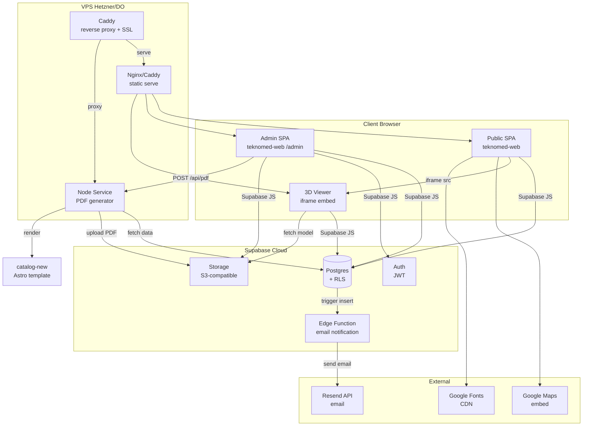
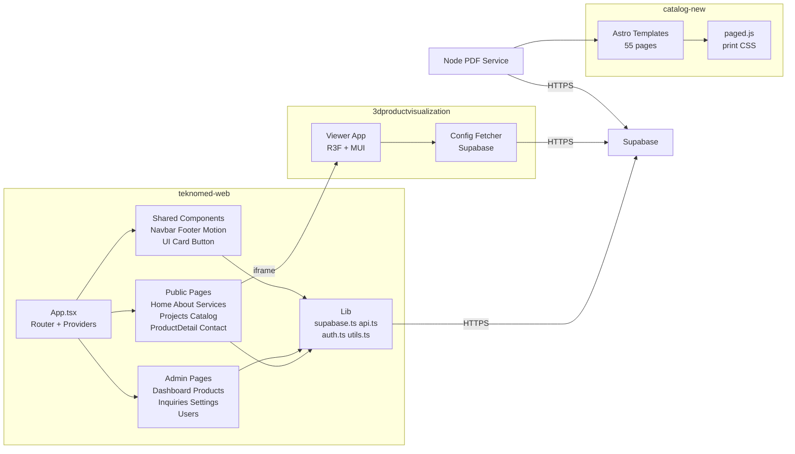
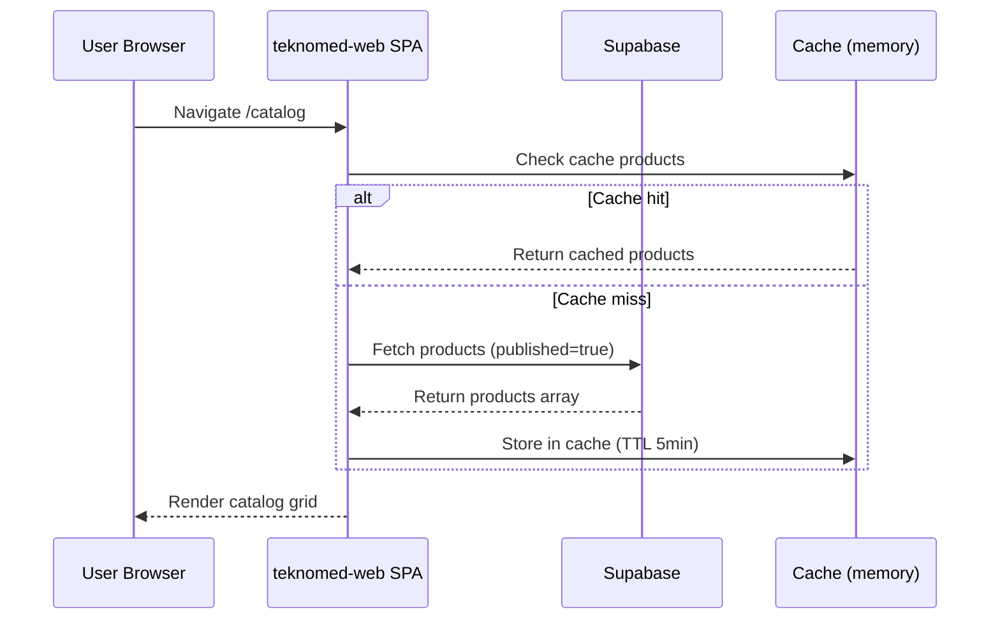
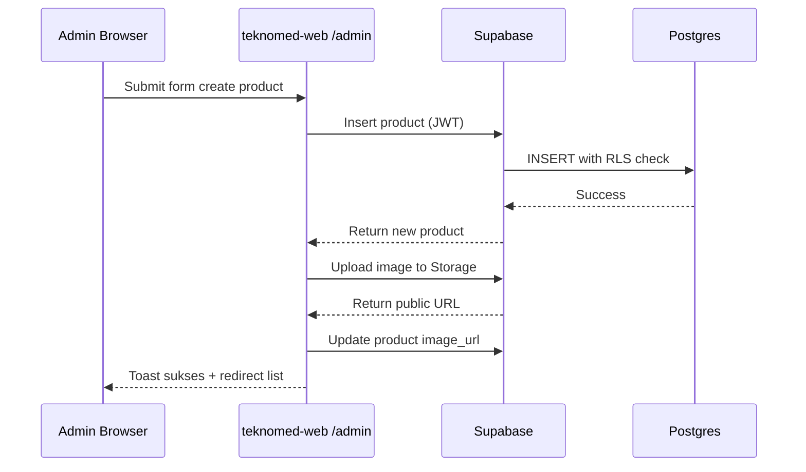
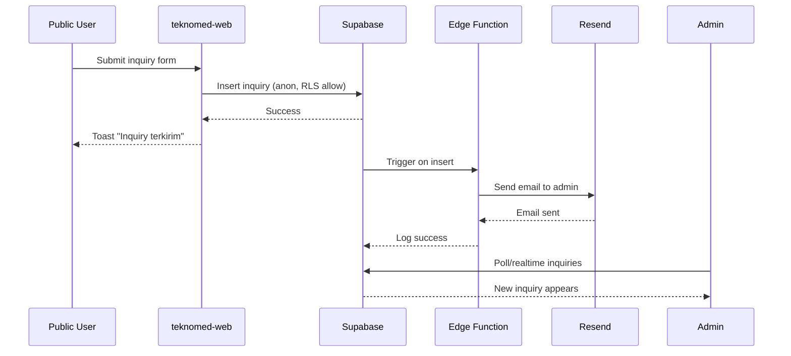
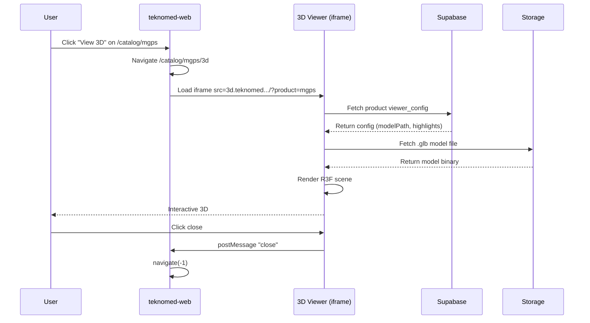
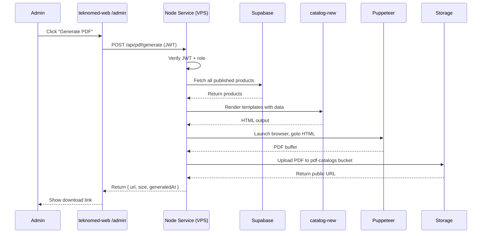
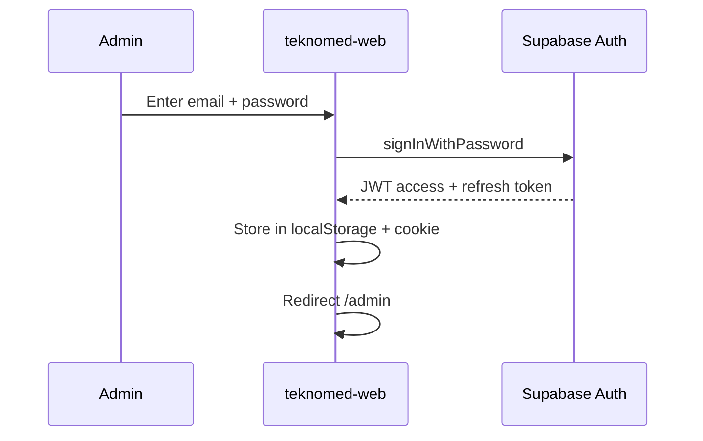
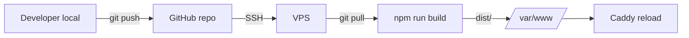

# 04 — Software Architecture Document (SAD)

> **Project**: Teknomed Integrated System
> **Versi**: 1.0.0 — 2026-06-18

## 1. Architecture Overview

### 1.1 System Architecture Diagram



### 1.2 Component Diagram



## 2. Technology Stack Decisions (ADR)

### ADR-01: Frontend Public — React 19 + Vite + Tailwind v4
- **Status**: Accepted
- **Context**: teknomed-web sudah pakai stack ini, Phase 1-4 selesai
- **Decision**: Pertahankan, tidak rewrite
- **Consequences**: 
  - Pro: Konsistensi, tidak buang kerja existing
  - Con: React 19 bleeding edge (tapi stable enough)

### ADR-02: Backend — Supabase (BaaS) bukan custom Node
- **Status**: Accepted
- **Context**: Butuh DB + Auth + Storage + RLS cepat, skill backend limited
- **Decision**: Supabase cloud (free tier)
- **Alternatives**: Firebase (NoSQL, kurang relational), custom Node+Postgres (terlalu banyak setup), PocketBase (self-hosted, kurang mature)
- **Consequences**:
  - Pro: Fast setup, RLS built-in, Auth built-in, Storage built-in, free tier
  - Con: Vendor lock-in, free tier limit 500MB DB

### ADR-03: Admin Panel — shadcn/admin di teknomed-web (bukan app terpisah)
- **Status**: Accepted
- **Context**: Butuh admin panel, teknomed-web sudah React, shadcn/ui compatible
- **Decision**: Build admin di route /admin/* teknomed-web, lazy loaded
- **Alternatives**: Refine.dev (terlalu opinionated), app terpisah (duplikasi code), Supabase Studio (kurang custom)
- **Consequences**:
  - Pro: Single deploy, shared components, sesuai vibe tweakcn
  - Con: Bundle admin terpisah perlu lazy load

### ADR-04: 3D Viewer Integration — iframe micro-frontend
- **Status**: Accepted
- **Context**: 3dproductvisualization pakai R3F + MUI, teknomed-web pakai three plain + Tailwind. Dependency conflict kalau di-bundle sama
- **Decision**: Deploy 3D viewer terpisah (subdomain), embed via iframe
- **Alternatives**: Module federation (kompleks), port komponen (effort besar, break aturan three plain), link terpisah (UX terputus)
- **Consequences**:
  - Pro: Isolasi sempurna, deploy independen, no bundle bloat
  - Con: iframe overhead, postMessage complexity

### ADR-05: PDF Generator — Node service + Puppeteer + catalog-new
- **Status**: Accepted
- **Context**: catalog-new sudah pakai Astro + paged.js untuk print-quality PDF
- **Decision**: Node service di VPS yang render Astro template + Puppeteer generate PDF
- **Alternatives**: Client-side react-pdf (kualitas render kurang), Supabase Edge Function (limit 150s, cold start), VPS Docker (overkill)
- **Consequences**:
  - Pro: Kualitas print bagus (paged.js), reuse catalog-new
  - Con: Butuh VPS, Puppeteer resource heavy

### ADR-06: Hosting — VPS Hetzner/DO + Caddy
- **Status**: Accepted
- **Context**: Butuh Node service untuk PDF, 3D asset serving, custom domain
- **Decision**: VPS Hetzner CX22 (€4.5/bln) atau DO Droplet ($6/bln) + Caddy auto-HTTPS
- **Alternatives**: Cloudflare Pages (tidak support Node service persistent), Vercel (limit function duration), pure Supabase (tidak serve static SPA)
- **Consequences**:
  - Pro: Full control, support Node service, murah
  - Con: Butuh DevOps setup, manual maintenance

### ADR-07: Theme Admin — tweakcn mono (terpisah dari public)
- **Status**: Accepted
- **Context**: Admin butuh vibe developer tool (dense, fast), public butuh medical authority (calm, premium)
- **Decision**: Apply tweakcn mono theme (Geist Mono, radius 0, no shadow) ke scope `[data-area="admin"]` saja
- **Consequences**:
  - Pro: Dua vibe berbeda dalam 1 app, tidak konflik
  - Con: CSS scoping complexity, butuh disiplin

### ADR-08: Data Layer — Supabase JS + cache + fallback
- **Status**: Accepted
- **Context**: Publik butuh data dinamis tapi tetap fast (cache), admin butuh real-time
- **Decision**: 
  - Public: fetch Supabase + cache di memory (SWR-like) + fallback ke hardcoded seed
  - Admin: fetch Supabase real-time (no cache)
- **Consequences**:
  - Pro: Fast public, real-time admin, resilient (fallback)
  - Con: Cache invalidation complexity

## 3. Data Flow

### 3.1 Public Page Load (e.g., /catalog)


### 3.2 Admin Create Product


### 3.3 Inquiry Submit


### 3.4 3D Viewer Load


### 3.5 PDF Generation


## 4. Security Architecture

### 4.1 Authentication Flow


### 4.2 Authorization (RBAC)
| Role | Permission |
|------|------------|
| anon (publik) | SELECT published content, INSERT inquiries |
| editor | + SELECT all, INSERT/UPDATE/DELETE products, projects, services, testimonials, inquiries |
| admin | + editor + UPDATE site_settings, manage users (non-super) |
| super_admin | + admin + DELETE users, assign roles, hard delete |

### 4.3 RLS Strategy
- Public tables (products, projects, services, testimonials, pages): `SELECT WHERE published=true`
- Admin tables (inquiries, profiles): `SELECT WHERE auth.uid() IN (SELECT id FROM profiles WHERE role IN (...))`
- Site settings: `SELECT` public, `UPDATE` admin+
- Storage: public read untuk published buckets, admin write

### 4.4 Secret Management
- Supabase: anon key (public, safe), service_role key (server only, di VPS env)
- Resend API key: Supabase secrets
- VPS: env vars di `/etc/systemd/system/node-pdf.service`
- Tidak ada secret di git (`.env` di `.gitignore`)

## 5. Deployment Architecture

### 5.1 VPS Topology
```
Internet → Cloudflare (optional CDN) → VPS
                                    ↓
                                 Caddy :443
                                    ↓
                    ┌───────────────┼───────────────┐
                    │               │               │
              teknomed-web    3d-viewer       Node PDF Service
              (static)        (static)        (localhost:3001)
                    │               │               │
                 Nginx          Nginx          reverse_proxy
```

### 5.2 Domain Routing
| Domain | Path | Target |
|--------|------|--------|
| teknomedindotimurpt.co.id | / | teknomed-web SPA |
| teknomedindotimurpt.co.id | /admin/* | teknomed-web SPA (admin route) |
| 3d.teknomedindotimurpt.co.id | / | 3d-viewer SPA |
| api.teknomedindotimurpt.co.id | /api/* | Node PDF Service |

### 5.3 Build & Deploy Pipeline


Manual deploy untuk KP (CI/CD optional via GitHub Actions).

## 6. Component Architecture (teknomed-web)

### 6.1 Folder Structure (target)
```
src/
├── app/                    # Public app
│   ├── pages/              # Home About Services Projects Catalog ProductDetail Contact
│   ├── components/         # Navbar Footer Motion Testimonials ErrorBoundary
│   └── lib/                # api.ts (public data fetch)
├── admin/                  # Admin app (lazy loaded)
│   ├── pages/              # Dashboard Products Projects Inquiries Settings Users
│   ├── components/         # AdminLayout DataTable FormField
│   └── lib/                # admin-api.ts auth.ts
├── shared/                 # Shared between app + admin
│   ├── components/ui/      # Button Card Badge Skeleton (shadcn)
│   ├── lib/                # supabase.ts utils.ts
│   └── types/              # index.ts
├── App.tsx                 # Router (public + admin)
└── index.css               # Public theme
src/admin/admin.css         # Admin theme (tweakcn mono)
```

### 6.2 Routing Structure
```tsx
// App.tsx
<Routes>
  {/* Public */}
  <Route path="/" element={<Home />} />
  <Route path="/about" element={<About />} />
  <Route path="/catalog/:slug/3d" element={<Product3DViewer />} />
  {/* ... */}
  
  {/* Admin (lazy + protected) */}
  <Route path="/admin/login" element={<AdminLogin />} />
  <Route path="/admin" element={<AdminGuard><AdminLayout /></AdminGuard>}>
    <Route index element={<Dashboard />} />
    <Route path="products" element={<ProductsList />} />
    <Route path="products/new" element={<ProductForm />} />
    <Route path="products/:id" element={<ProductForm />} />
    {/* ... */}
  </Route>
</Routes>
```

## 7. Performance Strategy

### 7.1 Public
- Code splitting per route (lazy import)
- Image: WebP/AVIF + lazy load + width/height (anti-CLS)
- Font: preload + display=swap
- Cache: SWR-like di `src/app/lib/api.ts` (TTL 5 min)
- CDN: Cloudflare di depan VPS (optional)
- Bundle: target < 300KB gzip main

### 7.2 Admin
- Lazy load admin chunk (terpisah dari public)
- Table: virtualization kalau data > 100 row
- Form: optimistic update
- Real-time: Supabase Realtime untuk inquiry baru (Could)

### 7.3 3D Viewer
- Lazy load Three.js (sudah, via iframe terpisah)
- Model: Draco compression (.glb)
- Texture: KTX2 (Basis)
- Fallback: image jika WebGL tidak support

## 8. Monitoring & Logging

### 8.1 Public
- Google Analytics 4 (page view, event)
- Sentry (error tracking) — Could have

### 8.2 Admin
- Supabase logs (Auth, DB, Storage)
- VPS: journald (systemd)
- Node service: pino logger → file

### 8.3 Alerting
- Supabase: email jika DB usage > 80%
- VPS: UptimeRobot (free) untuk ping
- Manual check: cron weekly

## 9. Scalability Considerations

Untuk KP, traffic kecil. Tapi design untuk scale:
- Supabase: auto-scale (cloud)
- VPS: upgrade ke CX32 (2 vCPU, 4GB) kalau perlu
- CDN: Cloudflare untuk static assets
- 3D viewer: bisa pindah ke Cloudflare Pages kalau traffic naik
- PDF service: bisa containerize + scale horizontal kalau perlu

## 10. Disaster Recovery

| Skenario | RTO | RPO | Strategy |
|----------|-----|-----|----------|
| VPS down | 1 jam | 0 | Cloudflare fallback ke static backup, redeploy VPS |
| Supabase down | 1 jam | 1 hari | Supabase SLA 99.9%, daily backup |
| DB corrupt | 4 jam | 1 hari | Restore dari Supabase backup |
| Code loss | 1 jam | 0 | Git di GitHub + local backup |
| Domain expire | 24 jam | 0 | Renewal reminder, backup domain |
