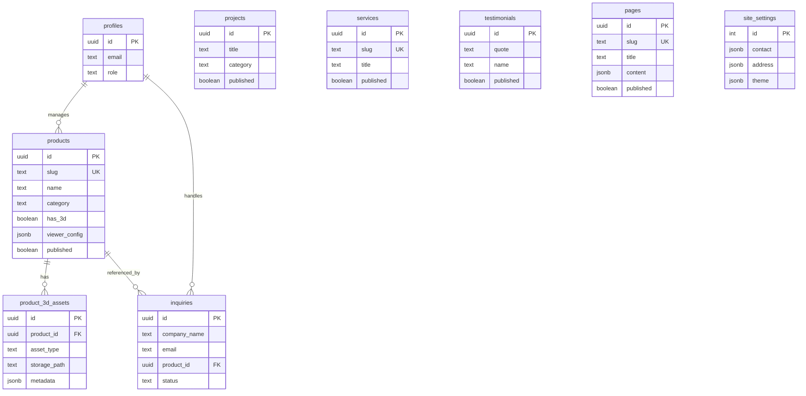

# 05 — Data Model (Supabase Schema + RLS)

> **Project**: Teknomed Integrated System
> **Versi**: 1.0.0 — 2026-06-18
> **DB**: Supabase Postgres 15

## 1. Schema Overview



## 2. SQL Schema

```sql
-- ============================================================
-- Teknomed Integrated System — Supabase Schema
-- Run di Supabase SQL Editor
-- ============================================================

-- Enable extensions
create extension if not exists "uuid-ossp";
create extension if not exists "pgcrypto";

-- ============================================================
-- 1. PROFILES (RBAC — link ke auth.users)
-- ============================================================
create table profiles (
  id uuid primary key references auth.users(id) on delete cascade,
  email text,
  full_name text,
  role text not null default 'viewer'
    check (role in ('super_admin', 'admin', 'editor', 'viewer')),
  created_at timestamptz default now(),
  updated_at timestamptz default now()
);

-- Auto-create profile saat user signup
create or replace function public.handle_new_user()
returns trigger
language plpgsql
security definer set search_path = public
as $$
begin
  insert into public.profiles (id, email, full_name)
  values (new.id, new.email, coalesce(new.raw_user_meta_data->>'full_name', new.email));
  return new;
end;
$$;

create trigger on_auth_user_created
  after insert on auth.users
  for each row execute function public.handle_new_user();

-- ============================================================
-- 2. PRODUCTS (katalog utama)
-- ============================================================
create table products (
  id uuid primary key default gen_random_uuid(),
  slug text unique not null,
  name text not null,
  short_name text,
  category text not null check (category in ('Konstruksi', 'Penjualan', 'Maintenance')),
  icon text, -- lucide icon name
  "desc" text, -- 'desc' reserved word, quote it
  summary text,
  specs jsonb default '[]'::jsonb,
  bullets jsonb default '[]'::jsonb,
  tags jsonb default '[]'::jsonb,
  -- 3D viewer
  has_3d boolean default false,
  viewer_config jsonb default '{}'::jsonb,
  -- Images
  image_url text,
  gallery jsonb default '[]'::jsonb, -- array of URLs
  -- SEO
  meta_title text,
  meta_description text,
  -- Status
  published boolean default true,
  sort_order int default 0,
  created_at timestamptz default now(),
  updated_at timestamptz default now()
);

create index idx_products_slug on products(slug);
create index idx_products_category on products(category);
create index idx_products_published on products(published);
create index idx_products_sort on products(sort_order);

-- ============================================================
-- 3. PRODUCT_3D_ASSETS
-- ============================================================
create table product_3d_assets (
  id uuid primary key default gen_random_uuid(),
  product_id uuid references products(id) on delete cascade,
  asset_type text not null check (asset_type in ('model', 'texture', 'env_map', 'screenshot')),
  storage_path text not null,
  metadata jsonb default '{}'::jsonb,
  created_at timestamptz default now()
);

create index idx_3d_assets_product on product_3d_assets(product_id);

-- ============================================================
-- 4. PROJECTS (portofolio)
-- ============================================================
create table projects (
  id uuid primary key default gen_random_uuid(),
  title text not null,
  subtitle text,
  category text not null check (category in ('Konstruksi', 'Penjualan', 'Maintenance')),
  area text,
  year text,
  scope jsonb default '[]'::jsonb,
  tags jsonb default '[]'::jsonb,
  highlight text,
  image_url text,
  map_query text,
  published boolean default true,
  sort_order int default 0,
  created_at timestamptz default now(),
  updated_at timestamptz default now()
);

create index idx_projects_category on projects(category);
create index idx_projects_published on projects(published);

-- ============================================================
-- 5. SERVICES
-- ============================================================
create table services (
  id uuid primary key default gen_random_uuid(),
  slug text unique not null,
  title text not null,
  description text,
  icon text,
  category text, -- 'construction' | 'sales' | 'maintenance'
  sort_order int default 0,
  published boolean default true,
  created_at timestamptz default now()
);

create index idx_services_slug on services(slug);
create index idx_services_published on services(published);

-- ============================================================
-- 6. TESTIMONIALS
-- ============================================================
create table testimonials (
  id uuid primary key default gen_random_uuid(),
  quote text not null,
  name text not null,
  role text,
  company text,
  project_context text,
  published boolean default true,
  sort_order int default 0,
  created_at timestamptz default now()
);

create index idx_testimonials_published on testimonials(published);

-- ============================================================
-- 7. PAGES (dynamic pages)
-- ============================================================
create table pages (
  id uuid primary key default gen_random_uuid(),
  slug text unique not null,
  title text not null,
  content jsonb default '{}'::jsonb, -- block-based (Notion-like)
  meta_title text,
  meta_description text,
  published boolean default true,
  created_at timestamptz default now(),
  updated_at timestamptz default now()
);

create index idx_pages_slug on pages(slug);
create index idx_pages_published on pages(published);

-- ============================================================
-- 8. SITE_SETTINGS (single row, id=1)
-- ============================================================
create table site_settings (
  id int primary key default 1,
  company_name text,
  tagline text,
  description text,
  founded int,
  contact jsonb default '{}'::jsonb, -- { email, phone, phoneHref, whatsapp }
  address jsonb default '{}'::jsonb, -- { full, city, province, zipCode }
  hours jsonb default '{}'::jsonb, -- { weekdays, weekend }
  service_areas jsonb default '[]'::jsonb,
  theme jsonb default '{}'::jsonb, -- { primary, secondary, accent, footer }
  social jsonb default '{}'::jsonb, -- { instagram, linkedin, facebook }
  logo text,
  favicon text,
  url text,
  updated_at timestamptz default now(),
  constraint single_row check (id = 1)
);

insert into site_settings (id, company_name, tagline, description, founded)
values (1, 'PT Teknomed Indo Timur', 'Medical Contractor',
  'Solusi konstruksi fasilitas kesehatan: MEP, tata udara, instalasi gas medis, Modular Operating Theatre, dan maintenance.',
  2021)
on conflict (id) do nothing;

-- ============================================================
-- 9. INQUIRIES
-- ============================================================
create table inquiries (
  id uuid primary key default gen_random_uuid(),
  company_name text not null,
  contact_person text not null,
  email text not null,
  phone text,
  product_id uuid references products(id) on delete set null,
  project_type text check (project_type in ('Konstruksi', 'Penjualan', 'Maintenance')),
  room_dimensions text,
  quantity int,
  message text not null,
  status text default 'new' check (status in ('new', 'contacted', 'quoted', 'won', 'lost')),
  admin_notes text,
  created_at timestamptz default now(),
  updated_at timestamptz default now()
);

create index idx_inquiries_status on inquiries(status);
create index idx_inquiries_created on inquiries(created_at desc);
create index idx_inquiries_product on inquiries(product_id);

-- ============================================================
-- 10. AUDIT_LOG (Could have)
-- ============================================================
create table audit_log (
  id uuid primary key default gen_random_uuid(),
  user_id uuid references profiles(id),
  action text not null, -- 'create', 'update', 'delete'
  table_name text not null,
  record_id uuid,
  old_data jsonb,
  new_data jsonb,
  created_at timestamptz default now()
);

create index idx_audit_user on audit_log(user_id);
create index idx_audit_table on audit_log(table_name);
create index idx_audit_created on audit_log(created_at desc);
```

## 3. RLS Policies

```sql
-- ============================================================
-- RLS — Row Level Security
-- ============================================================

-- Helper function: cek role current user
create or replace function public.is_admin()
returns boolean
language sql
security definer set search_path = public
as $$
  select exists (
    select 1 from profiles
    where id = auth.uid()
    and role in ('super_admin', 'admin', 'editor')
  );
$$;

create or replace function public.is_super_admin()
returns boolean
language sql
security definer set search_path = public
as $$
  select exists (
    select 1 from profiles
    where id = auth.uid()
    and role = 'super_admin'
  );
$$;

-- ============================================================
-- PROFILES
-- ============================================================
alter table profiles enable row level security;

create policy "Users read own profile"
  on profiles for select
  using (auth.uid() = id);

create policy "Users update own profile"
  on profiles for update
  using (auth.uid() = id);

create policy "Admins read all profiles"
  on profiles for select
  using (public.is_admin());

create policy "Super admins manage profiles"
  on profiles for all
  using (public.is_super_admin());

-- ============================================================
-- PRODUCTS
-- ============================================================
alter table products enable row level security;

create policy "Public read published products"
  on products for select
  using (published = true);

create policy "Admin manage products"
  on products for all
  using (public.is_admin());

-- ============================================================
-- PRODUCT_3D_ASSETS
-- ============================================================
alter table product_3d_assets enable row level security;

create policy "Public read 3d assets"
  on product_3d_assets for select
  using (
    exists (
      select 1 from products
      where products.id = product_3d_assets.product_id
      and products.published = true
    )
  );

create policy "Admin manage 3d assets"
  on product_3d_assets for all
  using (public.is_admin());

-- ============================================================
-- PROJECTS
-- ============================================================
alter table projects enable row level security;

create policy "Public read published projects"
  on projects for select
  using (published = true);

create policy "Admin manage projects"
  on projects for all
  using (public.is_admin());

-- ============================================================
-- SERVICES
-- ============================================================
alter table services enable row level security;

create policy "Public read published services"
  on services for select
  using (published = true);

create policy "Admin manage services"
  on services for all
  using (public.is_admin());

-- ============================================================
-- TESTIMONIALS
-- ============================================================
alter table testimonials enable row level security;

create policy "Public read published testimonials"
  on testimonials for select
  using (published = true);

create policy "Admin manage testimonials"
  on testimonials for all
  using (public.is_admin());

-- ============================================================
-- PAGES
-- ============================================================
alter table pages enable row level security;

create policy "Public read published pages"
  on pages for select
  using (published = true);

create policy "Admin manage pages"
  on pages for all
  using (public.is_admin());

-- ============================================================
-- SITE_SETTINGS
-- ============================================================
alter table site_settings enable row level security;

create policy "Public read site settings"
  on site_settings for select
  using (true);

create policy "Admin update site settings"
  on site_settings for update
  using (public.is_admin());

-- ============================================================
-- INQUIRIES
-- ============================================================
alter table inquiries enable row level security;

-- Public bisa insert (form inquiry)
create policy "Public submit inquiries"
  on inquiries for insert
  with check (true);

-- Admin bisa read + update + delete
create policy "Admin read inquiries"
  on inquiries for select
  using (public.is_admin() or public.is_super_admin());

create policy "Admin update inquiries"
  on inquiries for update
  using (public.is_admin() or public.is_super_admin());

create policy "Admin delete inquiries"
  on inquiries for delete
  using (public.is_super_admin());

-- ============================================================
-- AUDIT_LOG
-- ============================================================
alter table audit_log enable row level security;

create policy "Admin read audit log"
  on audit_log for select
  using (public.is_admin());

create policy "System insert audit log"
  on audit_log for insert
  with check (public.is_admin());
```

## 4. Storage Buckets

```sql
-- ============================================================
-- STORAGE BUCKETS
-- ============================================================

-- 3D model files (.glb, .gltf)
insert into storage.buckets (id, name, public)
values ('3d-models', '3d-models', true)
on conflict (id) do nothing;

-- Product images
insert into storage.buckets (id, name, public)
values ('product-images', 'product-images', true)
on conflict (id) do nothing;

-- PDF catalogs
insert into storage.buckets (id, name, public)
values ('pdf-catalogs', 'pdf-catalogs', true)
on conflict (id) do nothing;

-- Project images
insert into storage.buckets (id, name, public)
values ('project-images', 'project-images', true)
on conflict (id) do nothing;

-- ============================================================
-- STORAGE POLICIES
-- ============================================================

-- Public read semua bucket
create policy "Public read 3d-models"
  on storage.objects for select
  using (bucket_id = '3d-models');

create policy "Public read product-images"
  on storage.objects for select
  using (bucket_id = 'product-images');

create policy "Public read pdf-catalogs"
  on storage.objects for select
  using (bucket_id = 'pdf-catalogs');

create policy "Public read project-images"
  on storage.objects for select
  using (bucket_id = 'project-images');

-- Admin write semua bucket
create policy "Admin write 3d-models"
  on storage.objects for insert
  with check (bucket_id = '3d-models' and public.is_admin());

create policy "Admin update 3d-models"
  on storage.objects for update
  using (bucket_id = '3d-models' and public.is_admin());

create policy "Admin delete 3d-models"
  on storage.objects for delete
  using (bucket_id = '3d-models' and public.is_admin());

-- (Repeat pattern untuk product-images, pdf-catalogs, project-images)
```

## 5. Seed Data (migration dari hardcoded TS)

```sql
-- ============================================================
-- SEED DATA — dari src/data/*.ts existing
-- ============================================================

-- Products
insert into products (slug, name, short_name, category, icon, "desc", summary, specs, bullets, tags, has_3d, published, sort_order) values
('mgps', 'Medical Gas Pipeline System', 'MGPS', 'Konstruksi', 'Syringe',
 'Perencanaan dan instalasi jaringan gas medis untuk fasilitas kesehatan.',
 'Solusi perencanaan dan instalasi jaringan gas medis untuk fasilitas kesehatan.',
 '["O2, N2O, CO2, Vacuum, Air Medis","Sesuai standar HTM 02-01 & NFPA 99","Commissioning & pressure testing","Sertifikasi dan dokumentasi lengkap"]'::jsonb,
 '["Perencanaan jalur pipa dan titik outlet sesuai standar","Instalasi sistem distribusi gas medis (O2, N2O, Vacuum, dll)","Pengujian kebocoran dan commissioning","Maintenance berkala dan after-sales support"]'::jsonb,
 '["Gas Medis","Pipeline","Instalasi"]'::jsonb, false, true, 1),

('mot', 'Modular Operating Theatre', 'MOT', 'Konstruksi', 'SquareStack',
 'Ruang operasi modular yang dapat dikustomisasi sesuai standar dan kebutuhan.',
 'Ruang operasi modular yang dapat dikustomisasi sesuai standar dan kebutuhan.',
 '["Panel modular anti-bakteri","Integrasi HVAC & electrical","Pintu hermetik & kontrol tekanan","Sesuai standar ISO 14644"]'::jsonb,
 '["Panel modular dinding dan plafon dengan finishing anti-bakteri","Integrasi HVAC, electrical, dan sistem pendukung","Pintu hermetik dan sistem kontrol tekanan","Maintenance dan after-sales support"]'::jsonb,
 '["Ruang Operasi","Modular","Cleanroom"]'::jsonb, false, true, 2),

('hvac-cleanroom', 'HVAC & Cleanroom', 'HVAC', 'Konstruksi', 'Wind',
 'Sistem tata udara untuk kenyamanan, kontrol temperatur, dan kebersihan ruangan.',
 'Sistem tata udara untuk kenyamanan, kontrol temperatur, dan kebersihan ruangan.',
 '["AHU, FCU, ducting & diffuser","Filtrasi HEPA H13/H14","Balancing & commissioning","BMS integration"]'::jsonb,
 '["Perencanaan load dan kebutuhan airflow","Instalasi AHU, ducting, dan diffuser","Balancing dan testing sesuai standar","Sistem filtrasi HEPA untuk cleanroom"]'::jsonb,
 '["HVAC","Cleanroom","Filtrasi"]'::jsonb, false, true, 3),

('electrical-mechanical', 'Electrical & Mechanical', 'E&M', 'Konstruksi', 'Zap',
 'Pekerjaan mekanikal dan elektrikal untuk proyek rumah sakit dan klinik.',
 'Pekerjaan mekanikal dan elektrikal untuk proyek rumah sakit dan klinik.',
 '["Panel MDP, SDP, distribusi daya","Grounding & lightning protection","Pompa, plumbing & fire protection","Koordinasi MEP terintegrasi"]'::jsonb,
 '["Instalasi panel listrik dan distribusi daya","Sistem grounding dan proteksi petir","Instalasi pompa, plumbing, dan fire protection","Koordinasi MEP terintegrasi"]'::jsonb,
 '["Electrical","Mechanical","MEP"]'::jsonb, false, true, 4),

('radiology-chiller', 'Radiology Room Chiller', 'Chiller', 'Penjualan', 'HardHat',
 'Sistem pendinginan khusus untuk ruang radiologi.',
 'Sistem pendinginan khusus untuk ruang radiologi.',
 '["Chiller dedicated radiologi","Kontrol temperatur presisi ±0.5°C","Monitoring & alarm system","Maintenance preventif berkala"]'::jsonb,
 '["Chiller dedicated untuk peralatan radiologi","Kontrol temperatur presisi","Monitoring dan alarm system","Maintenance preventif berkala"]'::jsonb,
 '["Chiller","Radiologi","Pendinginan"]'::jsonb, false, true, 5),

('consumables-spareparts', 'Consumables & Spare Parts', 'Sparepart', 'Penjualan', 'Package',
 'Pengadaan consumable dan spare part peralatan medis.',
 'Pengadaan consumable dan spare part peralatan medis.',
 '["Filter HEPA & pre-filter","Spare part AHU & ducting","Komponen gas medis (valve, regulator)","Consumable maintenance rutin"]'::jsonb,
 '["Filter HEPA dan pre-filter","Spare part AHU dan ducting","Komponen gas medis (valve, regulator, outlet)","Consumable maintenance rutin"]'::jsonb,
 '["Consumable","Spare Part","Pengadaan"]'::jsonb, false, true, 6);

-- Projects
insert into projects (title, subtitle, category, area, year, scope, tags, highlight, image_url, map_query, published, sort_order) values
('Modular Operating Theatre', 'RSUD Dr. Sam Ratulangi, Manado', 'Konstruksi', 'Sulawesi', '2023',
 '["Panel modular dinding & plafon","Integrasi HVAC & gas medis","Pintu hermetik & kontrol tekanan","Electrical & lighting"]'::jsonb,
 '["MOT","Cleanroom","MEP"]'::jsonb, 'Ruang operasi modular standar internasional',
 'https://images.unsplash.com/photo-1551190822-a9333d879b1f?w=800&q=80',
 'RSUD+Dr+Sam+Ratulangi+Manado+Sulawesi+Utara', true, 1),
-- ... (5 projects lain, sesuaikan dengan src/data/projects.ts)

-- Testimonials
insert into testimonials (quote, name, role, company, project_context, published, sort_order) values
('Tim Teknomed menyelesaikan instalasi Modular Operating Theatre kami sesuai standar ISO 14644. Koordinasi MEP, HVAC, dan gas medis berjalan tertib, commissioning lancar tanpa revisi major.',
 'dr. Manoppo, M.Kes', 'Kepala Instalasi Bedah Sentral', 'RSUD Dr. Sam Ratulangi',
 'Proyek MOT, Manado 2023', true, 1),
-- ... (3 testimonials lain)

-- Site settings (sudah di-insert di schema, update dengan data lengkap)
update site_settings set
  contact = '{"email":"teknomedindotimurpt@gmail.com","phone":"+62 812-4436-0317","phoneHref":"tel:+6281244360317","whatsapp":"https://wa.me/6281244360317"}'::jsonb,
  address = '{"full":"Perumahan Tamansari Metropolitan, Cluster Lihaga, Ruko No.19, Paniki Bawah, Mapanget, Manado, Sulawesi Utara 95256","city":"Manado","province":"Sulawesi Utara","zipCode":"95256"}'::jsonb,
  hours = '{"weekdays":"Senin - Jumat, 08.00 - 17.00 WITA","weekend":"Sabtu & Minggu: Tutup"}'::jsonb,
  service_areas = '["Jawa Timur","Bali","NTB","NTT","Sulawesi"]'::jsonb,
  theme = '{"primary":"#043962","secondary":"#7aaed6","accent":"#1d4f7a","footer":"#031a2e"}'::jsonb,
  logo = '/logo_pt.png',
  favicon = '/favicon.svg',
  url = 'https://teknomedindotimurpt.co.id'
where id = 1;
```

## 6. Indexes (summary)

| Table | Index | Purpose |
|-------|-------|---------|
| products | slug | Lookup by slug |
| products | category | Filter by category |
| products | published | Filter published |
| products | sort_order | Order |
| product_3d_assets | product_id | Join |
| projects | category | Filter |
| projects | published | Filter |
| services | slug | Lookup |
| inquiries | status | Filter inbox |
| inquiries | created_at | Sort recent |
| inquiries | product_id | Join |
| audit_log | user_id | Filter by user |
| audit_log | created_at | Sort recent |

## 7. Migration Strategy

1. **Phase A**: Run schema SQL di Supabase SQL Editor
2. **Phase A**: Run RLS policies SQL
3. **Phase A**: Run storage buckets SQL
4. **Phase A**: Run seed data SQL (dari hardcoded TS)
5. **Phase B**: Update teknomed-web untuk fetch dari Supabase (hardcoded jadi fallback)
6. **Phase C**: Admin panel CRUD → data langsung ke Supabase

## 8. Backup Strategy

- **Supabase**: daily automatic backup (free tier: 7 days retention)
- **Manual**: export SQL via `pg_dump` weekly (cron di VPS)
- **Critical data**: inquiries + products (export CSV monthly via admin)
