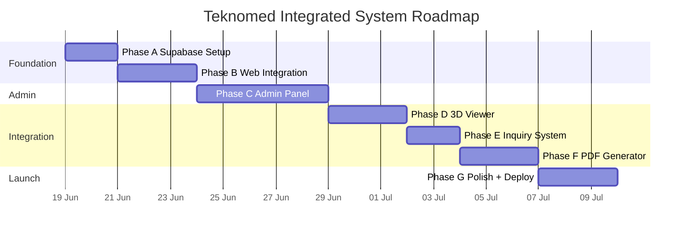

# 06 — Roadmap (Phase Execution Plan)

> **Project**: Teknomed Integrated System
> **Versi**: 1.0.0 — 2026-06-18
> **Total estimasi**: 13-21 hari kerja (2-4 minggu)

## Overview

## Phase A — Supabase Setup (1-2 hari)

**Goal**: Backend ready dengan schema, RLS, storage, seed data.

### Tasks
| ID | Task | Effort | Skill/Agent |
|----|------|--------|-------------|
| A-01 | Buat Supabase project (cloud) | 15 min | Manual |
| A-02 | Run schema SQL (05-DATA_MODEL.md section 2) | 30 min | db-admin agent |
| A-03 | Run RLS policies SQL (section 3) | 30 min | db-admin agent |
| A-04 | Run storage buckets SQL (section 4) | 15 min | db-admin agent |
| A-05 | Run seed data SQL (section 5) | 30 min | db-admin agent |
| A-06 | Create admin user via Supabase Auth | 10 min | Manual |
| A-07 | Assign role super_admin ke admin user | 5 min | Manual SQL |
| A-08 | Test RLS: anon read published, admin write | 30 min | db-admin agent |
| A-09 | Document env vars (URL, anon key, service key) | 10 min | Manual |

### Deliverables
- [ ] Supabase project live
- [ ] 9 tables + RLS + 4 storage buckets
- [ ] Seed data (6 products, 6 projects, 6 services, 4 testimonials, site_settings)
- [ ] 1 admin user (super_admin)
- [ ] Env vars documented di `.env.local`

### Dependencies
- Supabase account (gratis)
- Data dari `src/data/*.ts` existing

### Acceptance
- `select * from products` returns 6 rows (anon)
- `insert into products` denied untuk anon
- `insert into products` success untuk admin
- Storage upload success untuk admin

---

## Phase B — teknomed-web Supabase Integration (2-3 hari)

**Goal**: Public pages fetch data dinamis dari Supabase, hardcoded jadi fallback.

### Tasks
| ID | Task | Effort | Skill/Agent |
|----|------|--------|-------------|
| B-01 | Install `@supabase/supabase-js` | 5 min | bash |
| B-02 | Buat `src/shared/lib/supabase.ts` (client singleton) | 30 min | deepseek-coder |
| B-03 | Buat `src/app/lib/api.ts` (data fetch + cache + fallback) | 2 jam | deepseek-coder |
| B-04 | Refactor `src/data/products.ts` → async fetch | 1 jam | deepseek-coder |
| B-05 | Refactor `src/data/projects.ts` → async fetch | 1 jam | deepseek-coder |
| B-06 | Refactor `src/data/services.ts` → async fetch | 30 min | deepseek-coder |
| B-07 | Refactor `src/data/testimonials.ts` → async fetch | 30 min | deepseek-coder |
| B-08 | Refactor `src/config/site.ts` → fetch site_settings | 1 jam | deepseek-coder |
| B-09 | Update pages: loading state (skeleton sudah ada) | 1 jam | deepseek-coder |
| B-10 | Update pages: error state (ErrorBoundary sudah ada) | 30 min | deepseek-coder |
| B-11 | Test: offline fallback ke hardcoded | 30 min | qa-tester |
| B-12 | Test: cache hit (second load faster) | 30 min | qa-tester |

### Deliverables
- [ ] `src/shared/lib/supabase.ts` (Supabase client)
- [ ] `src/app/lib/api.ts` (data layer dengan cache + fallback)
- [ ] 5 page refactored (Home, About, Services, Projects, Catalog, ProductDetail, Contact)
- [ ] Loading + error states di semua page
- [ ] Hardcoded data tetap ada sebagai fallback/seed

### Dependencies
- Phase A selesai (Supabase live)
- Env vars: `VITE_SUPABASE_URL`, `VITE_SUPABASE_ANON_KEY`

### Acceptance
- Home page load < 3s, data dari Supabase
- Jika Supabase down, page tetap render dengan data fallback
- Cache hit: second load < 1s
- Lighthouse Performance >= 90

---

## Phase C — Admin Panel (3-5 hari)

**Goal**: Admin panel berfungsi dengan auth, RBAC, CRUD lengkap.

### Tasks
| ID | Task | Effort | Skill/Agent |
|----|------|--------|-------------|
| C-01 | `npx shadcn@latest init` di teknomed-web | 15 min | bash + shadcn MCP |
| C-02 | Add shadcn components (button, input, table, dialog, form, dropdown-menu, select, tabs, toast, badge, card, separator, sheet, command) | 30 min | shadcn MCP |
| C-03 | Apply tweakcn mono theme ke `src/admin/admin.css` | 30 min | tweakcn MCP |
| C-04 | Buat `src/admin/lib/auth.ts` (auth context + guard) | 1 jam | deepseek-coder |
| C-05 | Buat `src/admin/components/AdminLayout.tsx` (sidebar + topbar) | 2 jam | frontend-expert |
| C-06 | Buat `src/admin/pages/Login.tsx` | 1 jam | frontend-expert |
| C-07 | Buat `src/admin/pages/Dashboard.tsx` (stats + chart) | 2 jam | frontend-expert |
| C-08 | Buat `src/admin/pages/Products/List.tsx` (table + search + pagination) | 2 jam | frontend-expert |
| C-09 | Buat `src/admin/pages/Products/Form.tsx` (create/edit) | 3 jam | frontend-expert |
| C-10 | Buat `src/admin/pages/Projects/List.tsx` + Form | 2 jam | frontend-expert |
| C-11 | Buat `src/admin/pages/Services/List.tsx` + Form | 1 jam | frontend-expert |
| C-12 | Buat `src/admin/pages/Testimonials/List.tsx` + Form | 1 jam | frontend-expert |
| C-13 | Buat `src/admin/pages/Inquiries/Inbox.tsx` (table + drawer detail) | 2 jam | frontend-expert |
| C-14 | Buat `src/admin/pages/Settings.tsx` (site settings form) | 2 jam | frontend-expert |
| C-15 | Buat `src/admin/pages/Users.tsx` (super_admin only) | 2 jam | frontend-expert |
| C-16 | Image upload ke Supabase Storage | 1 jam | deepseek-coder |
| C-17 | 3D asset upload + viewer config editor | 2 jam | frontend-expert |
| C-18 | Protected routes + RBAC guard | 1 jam | deepseek-coder |
| C-19 | Focus trap di admin modals (reuse useFocusTrap) | 30 min | deepseek-coder |
| C-20 | Test: CRUD semua entity | 2 jam | qa-tester |
| C-21 | Test: RBAC (editor vs admin vs super_admin) | 1 jam | qa-tester |

### Deliverables
- [ ] Admin panel live di `/admin/*`
- [ ] Login berfungsi (Supabase Auth)
- [ ] CRUD: products, projects, services, testimonials, inquiries
- [ ] Site settings editable
- [ ] User management (super_admin)
- [ ] Image + 3D asset upload
- [ ] tweakcn mono theme applied
- [ ] RBAC enforced (frontend + RLS backend)

### Dependencies
- Phase B selesai (Supabase integration)
- shadcn/ui + tweakcn MCP

### Acceptance
- Admin bisa login + CRUD produk
- Editor tidak bisa akses user management
- Image upload ke Storage, URL tersimpan di DB
- Theme admin: Geist Mono, radius 0, no shadow

---

## Phase D — 3D Viewer Integration (2-3 hari)

**Goal**: 3D viewer ter-embed di teknomed-web via iframe, fetch config dari Supabase.

### Tasks
| ID | Task | Effort | Skill/Agent |
|----|------|--------|-------------|
| D-01 | Deploy 3dproductvisualization ke VPS (subdomain `3d.teknomed...`) | 1 jam | bash + DevOps |
| D-02 | Modifikasi 3D viewer: tambah env Supabase | 30 min | deepseek-coder |
| D-03 | Modifikasi 3D viewer: fetch product config dari Supabase | 2 jam | deepseek-coder |
| D-04 | Modifikasi 3D viewer: fetch model dari Supabase Storage | 1 jam | deepseek-coder |
| D-05 | Modifikasi 3D viewer: postMessage ke parent (close, screenshot) | 1 jam | deepseek-coder |
| D-06 | teknomed-web: buat route `/catalog/:slug/3d` | 30 min | deepseek-coder |
| D-07 | teknomed-web: komponen `<Product3DViewer />` (iframe embed) | 1 jam | frontend-expert |
| D-08 | teknomed-web: postMessage listener (close → navigate back) | 30 min | deepseek-coder |
| D-09 | teknomed-web: "View 3D" button di ProductDetail | 15 min | frontend-expert |
| D-10 | teknomed-web: loading state iframe | 30 min | frontend-expert |
| D-11 | Test: iframe load, 3D render, close | 1 jam | qa-tester |
| D-12 | Test: mobile responsive iframe | 30 min | qa-tester |

### Deliverables
- [ ] 3D viewer live di `3d.teknomedindotimurpt.co.id`
- [ ] teknomed-web route `/catalog/:slug/3d` berfungsi
- [ ] iframe embed + postMessage communication
- [ ] 3D config dari Supabase (model path, highlights, camera)
- [ ] "View 3D" button di ProductDetail (if has_3d=true)

### Dependencies
- Phase A selesai (Supabase + Storage)
- Phase B selesai (product data dinamis)
- VPS setup (atau sementara deploy ke Cloudflare Pages)

### Acceptance
- Click "View 3D" → full screen iframe load
- 3D model render, user bisa rotate/zoom/exploded
- Click close → back to ProductDetail
- Mobile: iframe responsive, touch control jalan

---

## Phase E — Inquiry System (1-2 hari)

**Goal**: Form inquiry publik + admin inbox + email notifikasi.

### Tasks
| ID | Task | Effort | Skill/Agent |
|----|------|--------|-------------|
| E-01 | Update Contact page: form inquiry dengan zod validation | 2 jam | frontend-expert |
| E-02 | Submit ke Supabase `inquiries` table | 30 min | deepseek-coder |
| E-03 | Honeypot field anti-spam | 15 min | deepseek-coder |
| E-04 | Toast sukses/error | 15 min | frontend-expert |
| E-05 | Supabase Edge Function: email notifikasi | 1 jam | deepseek-coder |
| E-06 | Resend API setup (API key di Supabase secrets) | 30 min | Manual |
| E-07 | Admin inbox: table + filter status | 2 jam | frontend-expert |
| E-08 | Admin inquiry detail drawer | 1 jam | frontend-expert |
| E-09 | Admin status update (new → contacted → quoted → won/lost) | 30 min | deepseek-coder |
| E-10 | Test: submit inquiry → admin terima email | 30 min | qa-tester |
| E-11 | Test: admin update status | 15 min | qa-tester |

### Deliverables
- [ ] Form inquiry di /contact dengan validation
- [ ] Submit → Supabase + toast + email notifikasi
- [ ] Admin inbox di `/admin/inquiries`
- [ ] Status update workflow
- [ ] Edge Function untuk email

### Dependencies
- Phase B selesai (Supabase integration)
- Phase C selesai (admin panel)
- Resend account (gratis 100 email/hari)

### Acceptance
- Publik submit inquiry → toast sukses + form reset
- Admin terima email dalam 1 menit
- Admin lihat inquiry di inbox + update status
- Honeypot block spam bot

---

## Phase F — PDF Generator (2-3 hari)

**Goal**: Admin bisa generate PDF katalog dari data Supabase.

### Tasks
| ID | Task | Effort | Skill/Agent |
|----|------|--------|-------------|
| F-01 | Setup Node service di VPS (Hono/Express) | 1 jam | deepseek-coder |
| F-02 | Install Puppeteer + catalog-new dependencies | 30 min | bash |
| F-03 | Endpoint `POST /api/pdf/generate` (JWT verify) | 1 jam | deepseek-coder |
| F-04 | Fetch data dari Supabase (service_role key) | 30 min | deepseek-coder |
| F-05 | Render Astro template (catalog-new) dengan data baru | 2 jam | deepseek-coder |
| F-06 | Puppeteer launch → goto → PDF | 1 jam | deepseek-coder |
| F-07 | Upload PDF ke Supabase Storage `pdf-catalogs` | 30 min | deepseek-coder |
| F-08 | Return response { url, size, generatedAt } | 15 min | deepseek-coder |
| F-09 | Admin UI: "Generate PDF" button + progress | 1 jam | frontend-expert |
| F-10 | Admin UI: download link + history | 30 min | frontend-expert |
| F-11 | Public: download link di footer atau /catalog | 30 min | frontend-expert |
| F-12 | Test: generate PDF < 60s | 30 min | qa-tester |
| F-13 | Test: PDF kualitas print bagus | 30 min | qa-tester |

### Deliverables
- [ ] Node service live di VPS (`api.teknomed...`)
- [ ] Endpoint PDF generator berfungsi
- [ ] Admin trigger generate + download
- [ ] Public download link
- [ ] PDF kualitas print (paged.js)

### Dependencies
- Phase A selesai (Supabase)
- Phase C selesai (admin panel)
- VPS setup (Phase G atau parallel)
- catalog-new (Astro template existing)

### Acceptance
- Admin klik "Generate PDF" → progress → download link dalam 60s
- PDF berisi semua published products
- PDF kualitas print bagus (A4, paged.js)
- Public bisa download PDF dari website

---

## Phase G — Polish + Deploy (2-3 hari)

**Goal**: Sistem live di VPS dengan SSL, backup, monitoring.

### Tasks
| ID | Task | Effort | Skill/Agent |
|----|------|--------|-------------|
| G-01 | VPS setup: Ubuntu 24.04 + Node 20 + Caddy | 1 jam | bash + DevOps |
| G-02 | Caddy config (3 domain: main, 3d, api) | 30 min | bash |
| G-03 | Build teknomed-web production → deploy | 30 min | bash |
| G-04 | Build 3dproductvisualization → deploy | 30 min | bash |
| G-05 | Setup Node PDF service (systemd) | 30 min | bash |
| G-06 | SSL auto (Caddy Let's Encrypt) | 15 min | Automatic |
| G-07 | DNS config (A record ke VPS IP) | 15 min | Manual |
| G-08 | Foto proyek asli (ganti Unsplash) | 2 jam | Manual + frontend-expert |
| G-09 | SEO: sitemap.xml dynamic | 1 jam | deepseek-coder |
| G-10 | SEO: JSON-LD per page | 1 jam | deepseek-coder |
| G-11 | SEO: robots.txt | 15 min | deepseek-coder |
| G-12 | Lighthouse audit + fix | 2 jam | qa-tester + frontend-expert |
| G-13 | Backup strategy: Supabase auto + VPS cron | 30 min | bash |
| G-14 | Monitoring: UptimeRobot + Sentry (optional) | 30 min | Manual |
| G-15 | Documentation: user guide admin | 2 jam | office-operator |
| G-16 | Smoke test production | 1 jam | qa-tester |

### Deliverables
- [ ] VPS live dengan 3 domain + SSL
- [ ] teknomed-web + 3D viewer + Node service deployed
- [ ] Foto proyek asli
- [ ] SEO lengkap (sitemap, JSON-LD, robots)
- [ ] Lighthouse >= 90 all category
- [ ] Backup + monitoring
- [ ] User guide admin

### Dependencies
- Phase A-F selesai
- VPS account (Hetzner/DO)
- Domain DNS access
- Foto proyek asli dari owner

### Acceptance
- `https://teknomedindotimurpt.co.id` live
- `https://3d.teknomedindotimurpt.co.id` live
- `https://api.teknomedindotimurpt.co.id` live
- Lighthouse Performance >= 90 mobile
- Admin bisa login + CRUD + generate PDF
- Publik bisa browse + inquiry + view 3D + download PDF

---

## Effort Summary

| Phase | Effort (hari) | Cumulative |
|-------|---------------|------------|
| A. Supabase Setup | 1-2 | 1-2 |
| B. Web Integration | 2-3 | 3-5 |
| C. Admin Panel | 3-5 | 6-10 |
| D. 3D Viewer | 2-3 | 8-13 |
| E. Inquiry System | 1-2 | 9-15 |
| F. PDF Generator | 2-3 | 11-18 |
| G. Polish + Deploy | 2-3 | 13-21 |

## Parallelization Opportunities

- **Phase D + E** bisa parallel (3D viewer + inquiry system independen)
- **Phase F** bisa mulai setelah Phase A + C (tidak perlu nunggu D + E)
- **Phase G-08 (foto asli)** bisa parallel sejak awal (tunggu owner)

## Risk Buffer

Tambah 20% buffer untuk:
- Debugging RLS policy
- 3D model optimization (Draco compression)
- PDF Puppeteer issues di VPS
- DNS propagation delay

**Total realistis: 16-25 hari (3-5 minggu)**
