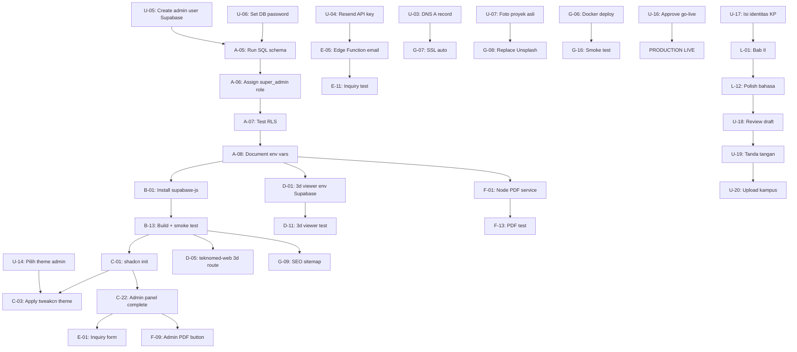

# 13 — Task Ownership (User vs Agent)

> **Project**: Teknomed Integrated System
> **Versi**: 1.0.0 — 2026-06-18
> **Tujuan**: Pemilahan tugas — mana yang HARUS user lakukan sendiri, mana yang bisa di-handle full agent.

## Legenda

| Simbol | Arti |
|--------|------|
| 👤 **USER** | Harus dilakukan user sendiri (butuh human action: akun, akses, keputusan, dokumen asli) |
| 🤖 **AGENT** | Bisa di-handle full agent (kode, config, deploy, dokumen teknis) |
| ⏳ **WAIT** | Tunggu USER selesai dulu sebelum AGENT bisa lanjut |

## 1. Tugas yang HARUS User Lakukan Sendiri

### 1.1 Akun & Akses (sekali setup)

| # | Tugas | Estimasi | Dependency | Status |
|---|------|----------|------------|--------|
| U-01 | Daftar Resend account (https://resend.com) | 5 menit | Email | ⏳ |
| U-02 | Add domain `teknomedindotimurpt.co.id` ke Resend, verify via DNS | 15 menit | U-03 | ⏳ |
| U-03 | Setup DNS A record (3 domain → `159.65.226.164`) di registrar/Cloudflare | 15 menit | Akses domain registrar | ⏳ |
| U-04 | Dapatkan Resend API key, simpan ke `C:\Users\warma\Downloads\sup_base.md` | 2 menit | U-01 | ⏳ |
| U-05 | Create admin user di Supabase Dashboard (email + password) | 5 menit | - | ⏳ |
| U-06 | Set DB password Supabase (simpan di password manager) | 2 menit | - | ✅ (sudah) |

### 1.2 Konten Asli (butuh data dari owner/field)

| # | Tugas | Estimasi | Dependency | Status |
|---|------|----------|------------|--------|
| U-07 | Siapkan foto proyek asli (ganti Unsplash) — minimal 6 proyek | 2-4 jam | Foto dari tim Teknomed | ⏳ |
| U-08 | Siapkan testimonial asli (ganti placeholder) — minimal 4 | 1-2 jam | Dari klien Teknomed | ⏳ |
| U-09 | Siapkan 3D model files (.glb) baru kalau ada produk baru | variabel | Dari tim Teknomed | ⏳ |
| U-10 | Siapkan logo partner/vendor/sertifikasi (ISO, HTM, NFPA) | 30 menit | Dari tim Teknomed | ⏳ |
| U-11 | Review + approve konten site_settings (contact, address, hours) | 15 menit | - | ⏳ |

### 1.3 Keputusan & Approval

| # | Tugas | Estimasi | Dependency | Status |
|---|------|----------|------------|--------|
| U-12 | Review + approve PRD (02-PRD.md) — jawab 7 open questions | 30 menit | - | ⏳ |
| U-13 | Review + approve SAD (04-SAD.md) — confirm 8 ADR | 20 menit | - | ⏳ |
| U-14 | Pilih warna theme admin (tweakcn mono atau custom) | 10 menit | - | ⏳ |
| U-15 | Confirm daftar admin users (siapa aja, role apa) | 10 menit | - | ⏳ |
| U-16 | Approve go-live deploy (setelah Phase G test) | 5 menit | Phase G test pass | ⏳ |

### 1.4 Akademik (KP)

| # | Tugas | Estimasi | Dependency | Status |
|---|------|----------|------------|--------|
| U-17 | Isi identitas KP (nama, NIM, periode, dosen pembimbing, pembimbing lapangan) | 5 menit | - | ⏳ |
| U-18 | Review draft laporan KP per bab (7 bab) | 2-3 jam total | Agent tulis draft | ⏳ |
| U-19 | Tanda tangan lembar pengesahan KP | 5 menit | Laporan final | ⏳ |
| U-20 | Upload laporan KP ke sistem kampus UBAYA | 15 menit | U-19 | ⏳ |
| U-21 | Siapkan presentasi KP (slide) | 2-3 jam | Laporan final | ⏳ |
| U-22 | Presentasi KP ke dosen pembimbing | 30-60 menit | U-21 | ⏳ |

### 1.5 Payment (kalau perlu upgrade)

| # | Tugas | Estimasi | Dependency | Status |
|---|------|----------|------------|--------|
| U-23 | Upgrade Supabase ke Pro ($25/bln) kalau free tier habis | 5 menit | Monitor usage | Optional |
| U-24 | Pay VPS DigitalOcean ($6/bln) | 5 menit | - | ✅ (sudah aktif) |

**Total estimasi USER: 8-15 jam** (tersebar, banyak yang parallel dengan agent)

---

## 2. Tugas yang BISA di-Handle Full Agent

### Phase A — Supabase Setup (butuh U-05, U-06)

| # | Tugas | Estimasi | Skill/Agent | Dependency |
|---|------|----------|-------------|------------|
| A-01 | Tulis SQL schema (9 tables) — sudah ada di docs/05-DATA_MODEL.md | ✅ done | - | - |
| A-02 | Tulis RLS policies SQL — sudah ada | ✅ done | - | - |
| A-03 | Tulis storage buckets SQL — sudah ada | ✅ done | - | - |
| A-04 | Tulis seed data SQL — sudah ada | ✅ done | - | - |
| A-05 | Run schema + RLS + storage + seed SQL via Supabase CLI | 30 menit | `supabase` skill, `db-admin` agent | U-06 |
| A-06 | Assign role super_admin ke admin user (U-05) | 5 menit | `db-admin` agent | U-05 |
| A-07 | Test RLS policies (anon read, admin write) | 30 menit | `db-admin` agent, `qa-tester` agent | A-05, A-06 |
| A-08 | Document env vars final ke `.env.local` | 10 menit | - | A-05 |

### Phase B — teknomed-web Supabase Integration (butuh A-08)

| # | Tugas | Estimasi | Skill/Agent | Dependency |
|---|------|----------|-------------|------------|
| B-01 | Install `@supabase/supabase-js` | 5 menit | bash | A-08 |
| B-02 | Buat `src/shared/lib/supabase.ts` (client singleton) | 30 menit | `supabase` skill, `deepseek-coder` agent | B-01 |
| B-03 | Buat `src/app/lib/api.ts` (data fetch + cache + fallback) | 2 jam | `supabase`, `typescript-pro` skill, `deepseek-coder` agent | B-02 |
| B-04 | Refactor `src/data/products.ts` → async fetch | 1 jam | `deepseek-coder` agent | B-03 |
| B-05 | Refactor `src/data/projects.ts` → async fetch | 1 jam | `deepseek-coder` agent | B-03 |
| B-06 | Refactor `src/data/services.ts` → async fetch | 30 menit | `deepseek-coder` agent | B-03 |
| B-07 | Refactor `src/data/testimonials.ts` → async fetch | 30 menit | `deepseek-coder` agent | B-03 |
| B-08 | Refactor `src/config/site.ts` → fetch site_settings | 1 jam | `deepseek-coder` agent | B-03 |
| B-09 | Update pages: loading state (skeleton sudah ada) | 1 jam | `frontend-expert` agent | B-04 to B-08 |
| B-10 | Update pages: error state (ErrorBoundary sudah ada) | 30 menit | `frontend-expert` agent | B-09 |
| B-11 | Test: offline fallback ke hardcoded | 30 menit | `qa-tester` agent | B-10 |
| B-12 | Test: cache hit (second load faster) | 30 menit | `qa-tester` agent | B-11 |
| B-13 | Build + lint + smoke test | 30 menit | `qa-tester`, `browser-operator` agent | B-12 |

### Phase C — Admin Panel (butuh B-13)

| # | Tugas | Estimasi | Skill/Agent | Dependency |
|---|------|----------|-------------|------------|
| C-01 | `npx shadcn@latest init` di teknomed-web | 15 menit | `shadcn` skill, bash | B-13 |
| C-02 | Add shadcn components (button, input, table, dialog, form, dll) | 30 menit | `shadcn` skill, shadcn MCP | C-01 |
| C-03 | Apply tweakcn mono theme ke `src/admin/admin.css` | 30 menit | `shadcn` skill, tweakcn MCP, U-14 | C-01 |
| C-04 | Buat `src/admin/lib/auth.ts` (auth context + guard) | 1 jam | `supabase` skill, `deepseek-coder` agent | C-01 |
| C-05 | Buat `src/admin/components/AdminLayout.tsx` (sidebar + topbar) | 2 jam | `ui-ux-pro-max`, `minimalist-ui` skill, `frontend-expert` agent | C-02, C-03 |
| C-06 | Buat `src/admin/pages/Login.tsx` | 1 jam | `frontend-expert` agent | C-04, C-05 |
| C-07 | Buat `src/admin/pages/Dashboard.tsx` (stats + chart) | 2 jam | `frontend-expert` agent | C-05 |
| C-08 | Buat `src/admin/pages/Products/List.tsx` (table + search + pagination) | 2 jam | `frontend-expert` agent | C-05 |
| C-09 | Buat `src/admin/pages/Products/Form.tsx` (create/edit) | 3 jam | `frontend-expert` agent, `zod-validation-expert` skill | C-08 |
| C-10 | Buat `src/admin/pages/Projects/List.tsx` + Form | 2 jam | `frontend-expert` agent | C-09 |
| C-11 | Buat `src/admin/pages/Services/List.tsx` + Form | 1 jam | `frontend-expert` agent | C-09 |
| C-12 | Buat `src/admin/pages/Testimonials/List.tsx` + Form | 1 jam | `frontend-expert` agent | C-09 |
| C-13 | Buat `src/admin/pages/Inquiries/Inbox.tsx` (table + drawer) | 2 jam | `frontend-expert` agent | C-09 |
| C-14 | Buat `src/admin/pages/Settings.tsx` (site settings form) | 2 jam | `frontend-expert` agent | C-09 |
| C-15 | Buat `src/admin/pages/Users.tsx` (super_admin only) | 2 jam | `frontend-expert` agent | C-09 |
| C-16 | Image upload ke Supabase Storage | 1 jam | `supabase` skill, `deepseek-coder` agent | C-09 |
| C-17 | 3D asset upload + viewer config editor | 2 jam | `frontend-expert` agent | C-16 |
| C-18 | Protected routes + RBAC guard | 1 jam | `auth-implementation-patterns` skill, `deepseek-coder` agent | C-04 |
| C-19 | Focus trap di admin modals (reuse useFocusTrap) | 30 menit | `deepseek-coder` agent | C-05 |
| C-20 | Test: CRUD semua entity | 2 jam | `qa-tester` agent | C-09 to C-15 |
| C-21 | Test: RBAC (editor vs admin vs super_admin) | 1 jam | `qa-tester` agent | C-18, C-20 |
| C-22 | Build + lint + smoke test | 30 menit | `qa-tester`, `browser-operator` agent | C-21 |

### Phase D — 3D Viewer Integration (butuh A-08, B-13)

| # | Tugas | Estimasi | Skill/Agent | Dependency |
|---|------|----------|-------------|------------|
| D-01 | Modifikasi 3d viewer: tambah env Supabase | 30 menit | `supabase` skill, `deepseek-coder` agent | A-08 |
| D-02 | Modifikasi 3d viewer: fetch product config dari Supabase | 2 jam | `supabase`, `threejs-webgl` skill, `deepseek-coder` agent | D-01 |
| D-03 | Modifikasi 3d viewer: fetch model dari Supabase Storage | 1 jam | `supabase`, `threejs-loaders` skill, `deepseek-coder` agent | D-02 |
| D-04 | Modifikasi 3d viewer: postMessage ke parent (close, screenshot) | 1 jam | `deepseek-coder` agent | D-02 |
| D-05 | teknomed-web: buat route `/catalog/:slug/3d` | 30 menit | `deepseek-coder` agent | B-13 |
| D-06 | teknomed-web: komponen `<Product3DViewer />` (iframe embed) | 1 jam | `frontend-expert` agent | D-05 |
| D-07 | teknomed-web: postMessage listener (close → navigate back) | 30 menit | `deepseek-coder` agent | D-06 |
| D-08 | teknomed-web: "View 3D" button di ProductDetail | 15 menit | `frontend-expert` agent | D-06 |
| D-09 | teknomed-web: loading state iframe | 30 menit | `frontend-expert` agent | D-06 |
| D-10 | Test: iframe load, 3D render, close | 1 jam | `qa-tester`, `browser-operator` agent | D-04, D-09 |
| D-11 | Test: mobile responsive iframe | 30 menit | `qa-tester` agent | D-10 |

### Phase E — Inquiry System (butuh C-22)

| # | Tugas | Estimasi | Skill/Agent | Dependency |
|---|------|----------|-------------|------------|
| E-01 | Update Contact page: form inquiry dengan zod validation | 2 jam | `zod-validation-expert`, `ui-styling` skill, `frontend-expert` agent | C-22 |
| E-02 | Submit ke Supabase `inquiries` table | 30 menit | `supabase` skill, `deepseek-coder` agent | E-01 |
| E-03 | Honeypot field anti-spam | 15 menit | `deepseek-coder` agent | E-02 |
| E-04 | Toast sukses/error | 15 menit | `frontend-expert` agent | E-02 |
| E-05 | Supabase Edge Function: email notifikasi | 1 jam | `supabase` skill, `deepseek-coder` agent | E-02, U-04 |
| E-06 | Set Resend API key di Supabase secrets | 5 menit | bash | U-04 |
| E-07 | Admin inbox: table + filter status (sudah di C-13) | ✅ done | - | C-13 |
| E-08 | Admin inquiry detail drawer (sudah di C-13) | ✅ done | - | C-13 |
| E-09 | Admin status update (sudah di C-13) | ✅ done | - | C-13 |
| E-10 | Test: submit inquiry → admin terima email | 30 menit | `qa-tester` agent | E-05, E-06 |
| E-11 | Test: admin update status | 15 menit | `qa-tester` agent | E-10 |

### Phase F — PDF Generator (butuh A-08, C-22)

| # | Tugas | Estimasi | Skill/Agent | Dependency |
|---|------|----------|-------------|------------|
| F-01 | Setup Node service (Hono/Express) | 1 jam | `api-design-principles` skill, `deepseek-coder` agent | A-08 |
| F-02 | Install Puppeteer + catalog-new dependencies | 30 menit | bash | F-01 |
| F-03 | Endpoint `POST /api/pdf/generate` (JWT verify) | 1 jam | `auth-implementation-patterns`, `supabase` skill, `deepseek-coder` agent | F-01 |
| F-04 | Fetch data dari Supabase (service_role key) | 30 menit | `supabase` skill, `deepseek-coder` agent | F-03 |
| F-05 | Render Astro template (catalog-new) dengan data baru | 2 jam | `deepseek-coder` agent | F-04 |
| F-06 | Puppeteer launch → goto → PDF | 1 jam | `deepseek-coder` agent | F-05 |
| F-07 | Upload PDF ke Supabase Storage `pdf-catalogs` | 30 menit | `supabase` skill, `deepseek-coder` agent | F-06 |
| F-08 | Return response { url, size, generatedAt } | 15 menit | `deepseek-coder` agent | F-07 |
| F-09 | Admin UI: "Generate PDF" button + progress | 1 jam | `frontend-expert` agent | C-22, F-08 |
| F-10 | Admin UI: download link + history | 30 menit | `frontend-expert` agent | F-09 |
| F-11 | Public: download link di footer atau /catalog | 30 menit | `frontend-expert` agent | F-10 |
| F-12 | Test: generate PDF < 60s | 30 menit | `qa-tester` agent | F-11 |
| F-13 | Test: PDF kualitas print bagus | 30 menit | `qa-tester` agent | F-12 |

### Phase G — Polish + Deploy (butuh U-03, U-04, semua phase)

| # | Tugas | Estimasi | Skill/Agent | Dependency |
|---|------|----------|-------------|------------|
| G-01 | VPS setup: upgrade Node 12 → 20 LTS | 30 menit | `devops-deploy` skill, bash | - |
| G-02 | VPS setup: install Docker Compose plugin | 15 menit | bash | - |
| G-03 | VPS setup: install Caddy | 15 menit | bash | - |
| G-04 | Clone 3 repo ke VPS | 15 menit | bash | G-01 |
| G-05 | Setup docker-compose.yml + Caddyfile + Dockerfiles | 1 jam | `devops-deploy`, `cloud-architect` skill, `deepseek-coder` agent | G-04 |
| G-06 | Build + deploy via Docker Compose | 30 menit | bash | G-05 |
| G-07 | SSL auto (Caddy Let's Encrypt) | 15 menit | Automatic | U-03, G-06 |
| G-08 | Foto proyek asli (ganti Unsplash) | 2 jam | `frontend-expert` agent | U-07 |
| G-09 | SEO: sitemap.xml dynamic | 1 jam | `seo` skill, `deepseek-coder` agent | B-13 |
| G-10 | SEO: JSON-LD per page | 1 jam | `seo-schema` skill, `deepseek-coder` agent | B-13 |
| G-11 | SEO: robots.txt | 15 menit | `deepseek-coder` agent | B-13 |
| G-12 | Lighthouse audit + fix | 2 jam | `web-performance-optimization` skill, `qa-tester`, `browser-operator` agent | G-06 |
| G-13 | Backup strategy: Supabase auto + VPS cron | 30 menit | `devops-deploy` skill, bash | G-06 |
| G-14 | Monitoring: UptimeRobot + Sentry (optional) | 30 menit | Manual + bash | G-06 |
| G-15 | Documentation: user guide admin (DOCX) | 2 jam | `documentation` skill, `office-operator` agent | C-22 |
| G-16 | Smoke test production | 1 jam | `qa-tester`, `browser-operator` agent | G-06 |

### Laporan KP (parallel, butuh U-17)

| # | Tugas | Estimasi | Skill/Agent | Dependency |
|---|------|----------|-------------|------------|
| L-01 | Tulis Bab II (Tinjauan Pustaka) | 3-4 jam | `academic-paper` skill, `office-operator` agent | U-17 |
| L-02 | Tulis Bab III (Analisis) | 2-3 jam | `academic-paper` skill, `office-operator` agent | U-17, docs/09 |
| L-03 | Tulis Bab IV (Perancangan) | 3-4 jam | `academic-paper` skill, `office-operator` agent | docs/04, docs/05 |
| L-04 | Tulis Bab V (Implementasi) | 4-5 jam | `academic-paper` skill, `office-operator` agent | Phase B-F |
| L-05 | Tulis Bab VI (Pengujian) | 2-3 jam | `academic-paper` skill, `office-operator` agent | Phase G |
| L-06 | Tulis Bab I (Pendahuluan) | 2 jam | `academic-paper` skill, `office-operator` agent | L-01 to L-05 |
| L-07 | Tulis Bab VII (Penutup) | 1 jam | `academic-paper` skill, `office-operator` agent | L-01 to L-05 |
| L-08 | Tulis halaman awal (cover, pengesahan, abstrak, kata pengantar, daftar isi) | 2 jam | `office-operator` agent | U-17, L-06 |
| L-09 | Kumpul daftar pustaka (APA 7th, 15-25 referensi) | 2 jam | `academic-paper` skill | L-01 to L-07 |
| L-10 | Tulis lampiran (kode kunci, screenshot) | 2 jam | `office-operator` agent | L-04 |
| L-11 | Convert MD → DOCX via pandoc (format UBAYA) | 1 jam | `docx` skill, bash | L-01 to L-10 |
| L-12 | Review + polish bahasa (anti-AI slop) | 3-5 jam | `academic-paper` skill | L-11 |

**Total estimasi AGENT: 80-120 jam** (bisa parallel, multi-agent)

---

## 3. Dependency Map (urutan eksekusi)



## 4. Critical Path (urutan yang tidak bisa di-skip)

```
U-05, U-06 (user setup Supabase)
    ↓
A-05 to A-08 (agent: run SQL + test)
    ↓
B-01 to B-13 (agent: teknomed-web integration)
    ↓
C-01 to C-22 (agent: admin panel)  ← longest phase (3-5 hari)
    ↓
E-01 to E-11 (agent: inquiry)  ← butuh U-04 (Resend)
    ↓
G-06 (agent: docker deploy)  ← butuh U-03 (DNS)
    ↓
G-16 (agent: smoke test)
    ↓
U-16 (user: approve go-live)
    ↓
PRODUCTION LIVE
```

**Parallel tracks** (bisa jalan bersamaan):
- Track 1: Phase A → B → C → E → G (critical path)
- Track 2: Phase D (3D viewer) — butuh A-08 + B-13, lalu independen
- Track 3: Phase F (PDF) — butuh A-08 + C-22, lalu independen
- Track 4: Laporan KP (L-01 to L-12) — butuh U-17, lalu independen (tapi L-04 butuh Phase B-F done)

## 5. Yang User Bisa Lakukan SEKARANG (parallel dengan agent)

Saat agent kerjakan Phase A (Supabase setup), user bisa parallel:

| User task | Estimasi | Butuh |
|-----------|----------|------|
| U-05: Create admin user Supabase | 5 menit | Supabase Dashboard access |
| U-12: Review PRD + jawab 7 open questions | 30 menit | Baca docs/02-PRD.md |
| U-13: Review SAD + confirm 8 ADR | 20 menit | Baca docs/04-SAD.md |
| U-14: Pilih theme admin | 10 menit | Lihat tweakcn.com/editor |
| U-15: Confirm daftar admin users | 10 menit | - |
| U-17: Isi identitas KP | 5 menit | - |
| U-07: Siapkan foto proyek asli | 2-4 jam | Foto dari tim Teknomed |
| U-08: Siapkan testimonial asli | 1-2 jam | Dari klien |

## 6. Yang User Bisa Tunda (nanti saja)

| User task | Kapan butuh |
|-----------|-------------|
| U-01, U-02, U-04: Resend | Phase E (inquiry email notification) |
| U-03: DNS A record | Phase G (deploy, butuh domain) |
| U-09: 3D model files baru | Setelah Phase D (kalau ada produk 3D baru) |
| U-10: Logo partner/sertifikasi | Phase G (polish) |
| U-11: Review site_settings | Setelah admin panel jadi (Phase C) |
| U-16: Approve go-live | Setelah Phase G test pass |
| U-18 to U-22: Akademik | Setelah laporan KP draft selesai (L-12) |
| U-23: Upgrade Supabase Pro | Kalau free tier habis (monitor) |

## 7. Summary

| Kategori | Jumlah task | Estimasi total |
|----------|-------------|----------------|
| 👤 USER (harus sendiri) | 24 task | 8-15 jam |
| 🤖 AGENT (bisa di-handle) | 80+ task | 80-120 jam |
| **Total** | **104+ task** | **88-135 jam** |

**Rasio**: User ~10%, Agent ~90%. User fokus di keputusan + konten asli + akademik. Agent fokus di kode + config + deploy + dokumen teknis.
